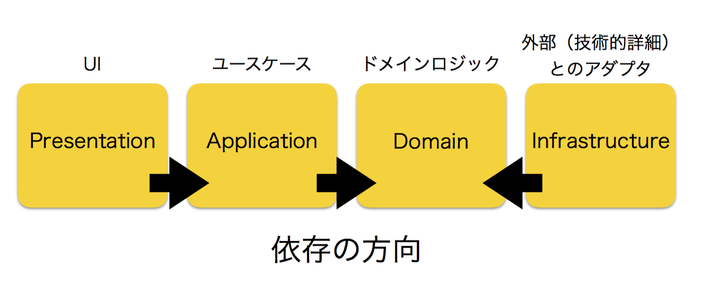

# NekogataDrumSequencer

## これはなに？

しんぺい a.k.a. 猫型蓄音機が、MVVMとCleanArchitectureの解説のために作ったデモアプリケーションです。「状態をたくさんもつ」ものとして、ドラムシーケンサーを実装しました。デモを[GithubPages](https://shinpeim.github.io/NekogataDrumSequencer/build/)で公開しています。

## MVVM と DDD-like Layered Architecture

MVVMパターンは、GUIのアーキテクチャパターンの一種で、PresentationとDomainの分離（PDS）を目的としたパターンです。MVVMパターンを採用することによって、プラットフォーム依存なUIの定義とイベントへの反応をViewとViewModelに書き、その他すべてをModelに書くことによって、「複雑だしプラットフォーム依存でテストしにくいUIのコード」と「アプリケーションの挙動をモデリングしたコード」を分離することができます。

その一方で、MVVMは「モデルはこう設計しましょう」ということについては指針をくれません。これは、言い方を変えれば、MVVMを採用したからといってアプリケーション全体の設計が決まるわけではなく、MVVMは「プレゼンテーションとその他をどうやって分けるか」について指針をくれるだけ、ということです。

一方、Layered Architectureは、その名のとおり、「アプリケーション全体を層に分けて設計しましょうね」という指針です。DDDの文脈では、よく「プレゼンテーション」「アプリケーション」「ドメイン」「インフラストラクチャ」の層に分けることによって「ドメイン知識」をドメイン層に分離する、という方針が取られることが多いようです。これをここでは「DDD-like Layered Architecture」と呼びましょう。

このあたりの話について、さらに知りたいひとは手前味噌ですが是非わたしの以下の発表を参考にしてください。

- see [「あの日見たM V WhateverのModelを僕たちはまだ知らない」実況中継](http://techblog.reraku.co.jp/entry/2016/12/13/080000)
- see [実況中継シリーズ Vue.jsで実現するMVVMパターン Fluxアーキテクチャとの距離](http://techblog.reraku.co.jp/entry/2016/07/06/070529)

さて、PDS、MVVM、DDD-like Layered Architectureというみっつの概念が出てきました。すべて、「アプリケーションをどのように分割するか」についての指針ですが、文脈が異なります。

PDSは「プレゼンテーションとその他を分けましょう」という指針です。

MVVMは、「実際にプレゼンテーションとその他を分けるときにはこういうふうにやるといいよ」という指針をくれます。

DDD-like Layered Architectureは、この「その他」の部分をさらに細かく「Application」「Domain」「Infrastructure」に分け、「アプリケーション全体はこうやって分けるといいよ」という指針をくれます。

これらの関係を図に表すと、下図のようになります。

図１：PDSとMVVMとDDD-like Layered Architectureの関係


このドキュメントでは、実際このリポジトリで開発されているアプリケーションの実装例を通じて、「それぞれのレイヤーがそれぞれをどのように呼び出したり依存したりするルールにするときれいにこれらの層が分離できるのか」について見ていきます。

## MVVMの文脈から見る、ViewModelの責務

MVVMにおいて、（PDSの文脈における）PresentationとDomainとのやりとりを実現してくれるのはViewModelです。ViewModelは、みっつの責務を持つことでPresentationとDomainを仲介します。

- Viewの描画のために必要なデータの保持
- Viewからのイベントに応じて、Modelのvoidなメソッドを呼び出す
- モデルの変化イベントに応じて、モデルの値を読み出して自身のデータを更新する

では、ここで実際に、ViewとViewModelの実装を見に行ってみましょう。今回のアプリケーションならば、`/presentation/vue_components`にかかれているものがViewとViewModelになります。ここでは[コントロールパネルのコンポーネント](https://github.com/Shinpeim/NekogataDrumSequencer/blob/development/src/js/presentation/vue_components/ControlPanel.vue)を見てみましょう。このコンポーネントでは、デモアプリの「再生ボタンとかbpmスライダーがある部分」のViewとViewModelが定義されています。

図２：再生ボタンとかbpmスライダーがある部分


### Viewの描画のために必要なデータの保持という責務

まずは、Viewの描画のために必要なデータの保持という責務について見ていきましょう。scriptの中身に、`data`というメソッドと`computed`というプロパティがあります（Vue.jsが定義してくれてるやつですね）が、Vue.jsにおいてはこれらがまさに「Viewのためのデータの保持」の役割です。

```javascript
        data(){
            return {
                bpm: this.usecase.player.bpm,
                selectedPatternId: this.usecase.sequencer.selectedPatternId,
                playingState: this.usecase.player.playingState,
                isSoundsInited: this.usecase.player.isSoundsInited
            }
        },

        computed:{
            playButtonIcon(){
                if (this.playingState) {
                    return 'stop';
                } else {
                    return 'play_arrow';
                }
            }
        }
```

まずは`data`を見てみましょう。たとえば、bpmスライダーの位置や、「現在のBPM」を描画するためには、現在設定されているbpmがいくつなのかという情報が必要になりますし、ラジオボタンのどれが選択されているかを描画するためには、今どのパターンが選択されているかという情報が必要になります。同じように、ボタンに再生マークを出すか停止マークを出すかを決めるためには、現在再生中なのか再生中でないのかという情報が必要になります。これらの情報を、`data`で返すオブジェクトのプロパティとして定義しています。

また、このアプリケーションはmaterializeというcssフレームワークを利用していますが、materializeでは再生マークを出すためには`play_arrow`という文字列が、停止マークを出すためには`stop`という文字列が必要になります。どちらの文字列をViewに渡すべきかというのは、`playingState`が決定すれば自動的に決定しますね、こういったデータについては、`computed`というプロパティに定義してあげるといいでしょう。

ここで定義されたプロパティは、`template`のなかでVue.jsが用意してくれたディレクティブなどから読み出すことができます。Vue.jsの詳しい使いかたについて説明し始めると長くなってしまうので（とはいえ学習コストの低いフレームワークではあります）、詳しくは[Vue.jsの公式のドキュメント](https://vuejs.org/)を当たってください。

### Viewからのイベントに応じて、Modelのvoidなメソッドを呼び出す責務

次に、Viewからのイベントに応じて、Modelのvoidなメソッドを呼び出す責務について見ていきます。`methods`というプロパティがその責務を実現しています。

```javascript
        methods: {
            setBpm(){
                const bpm = document.getElementById("bpm-slider").value;
                this.usecase.setBpm(bpm);
            },

            setPatternId() {
                this.usecase.selectPattern(this.selectedPatternId);
            },

            togglePlayingState(){
                this.usecase.togglePlayingState();
            }
        }
```

bpmスライダーのViewは

```html
<input type="range" id="bpm-slider" min="10" max="240" :value="bpm" @input="setBpm"/>
```

と定義されていますが、ユーザがスライダーを変化させると、HTML上に定義されている`@input="setBpm"`イベントが発火し、`methods`プロパティ内に定義されている`setBpm`メソッドが呼び出されます。ここが、「Viewからのイベントに応じ」の部分です。`setBpm`メソッドの中身を見てみると、DOMから「現在選択されているbpm」を読み出し、`this.usecase`のメソッドを呼び出しています。`this.usecase`について、詳しくは後述しますが、ViewModelが保持している、「Model層の窓口」だと思ってください。ここが「Modelのvoidなメソッドを呼び出す」の部分です。

### モデルの変化イベントに応じて、モデルの値を読み出して自身のデータを更新する責務について

最後に、モデルの変化イベントに応じて、モデルの値を読み出して自身のデータを更新するという責務について見ていきましょう。

さきほど、「Viewからのイベントに応じて、Modelのvoidなメソッドを呼び出す」責務について見ました。しかし、当たりまえですが、voidなメソッドには返り値がありません。これでは、「ViewModel -> Model」のコミュニケーションはできますが、「Model -> ViewModel」のコミュニケーションができませんね。

MVVMアーキテクチャでは、ModelからViewModelへのコミュニケーションは「Modelが変化したよ」というイベントを通知する形で行います。ViewModelは、そのイベントを受け取ったら、Modelの内容を読み取って、自身のデータに書き戻します。それを行っているのが`created`プロパティです。

```javascript
       created(){
            this.subscriptions.push(
                // (1)
                this.usecase.selectedPatternChanged.subscribe(() => {
                    this.selectedPatternId = this.usecase.sequencer.selectedPatternId;
                })
            );

            this.subscriptions.push(
                this.usecase.playingStateChanged.subscribe(() => {
                    this.playingState = this.usecase.player.playingState;
                })
            );

            this.subscriptions.push(
                this.usecase.bpmChanged.subscribe(() => {
                    this.bpm= this.usecase.player.bpm;
                })
            );

            this.subscriptions.push(
                this.usecase.isSoundsInitedChanged.subscribe(() => {
                    console.debug(this.usecase.player);
                    this.isSoundsInited = this.usecase.player.isSoundsInited;
                })
            );
        },
```

まずは

```javascript
//(1)
this.usecase.selectedPatternChanged.subscribe(() => {
    this.selectedPatternId = this.usecase.sequencer.selectedPatternId;
})
```

の部分を見てください。「Modelの窓口」に当たる`usecase`が、`selectedPatternChanged`というプロパティを持っています。Modelが保持している「今どのパターンが選択されているか」という情報が変化したときに、このプロパティはイベントを発火させます（というか、Model層にそういう処理が書かれています）。

で、このプロパティに対して、`subscribe`することで、リスナーを登録しています。リスナーの中身は、`this.selectedPatternId = this.usecase.sequencer.selectedPatternId;`となっており、「モデルの値を読み出してきて、自身のデータ（`data`プロパティで定義したやつです）に書き戻していますね。ViewModelのデータがこうして更新されると、Vue.jsの「データバインド」の仕組みで、画面が書き換わる、というわけです。

`this.subscriptions`とかは、`Base.js`で定義されてるやつで、ここに登録しておいたリスナーはコンポーネントが破棄されるときに勝手に`unsubscribe`してくれるようになっています。

`created`はコンポーネントが作られたときに呼ばれるhookですが、コンポーネントが作られたときに「Modelが変化したっていうイベントを受け取ったらその内容を自分に書き戻す」というリスナーを登録しているわけですね。

### ViewModelの責務まとめ

さて、これで、

- Viewの描画のために必要なデータの保持
- Viewからのイベントに応じて、Modelのvoidなメソッドを呼び出す
- モデルの変化イベントに応じて、モデルの値を読み出して自身のデータを更新する

というViewModelのみっつの責務を確認できました。

重要なのは、Modelのメソッド呼び出しがvoidであることと、Modelからの変更通知はイベントを通じて行う、という部分です。

これによって、モデルのメソッド呼び出しという「更新系」の窓口、モデルの状態読み出しという「参照系」の窓口が分離されます。この分離を行うことで、PDSの文脈における「Presentation」と「Domain」を疎結合に保つことに成功しているのが、MVVMアーキテクチャである、と考えてください。

## DDD-like Layered Architectureで複雑なモデルと非同期処理に立ち向かう

さて、MVVMパターンを利用することによって、(PDSという文脈における)プレゼンテーション層とドメイン層の分離に成功しました。ここからは、PDSの文脈におけるドメイン層をさらに詳しく見ていきます。PDSの文脈における「ドメイン層」は、MVVMの文脈においてはモデル層に相当しますが、DDD-like Architectureにも「ドメイン層」という言葉が出てきて混乱のもとなので、ここから先は(PDS)における「ドメイン層」のことを「モデル層」と呼称します。

さて、DDD-like Layered Architectureでは、モデル層を「Application」「Domain」「Infrastructure」の層に分離します。そして、勘所は、ドメイン層にあります。

### ドメイン層

ドメインレイヤーは、問題領域の「ユビキタス言語」を表現するようにモデリングします。ユビキタス言語については今回深入りしませんが、関わるひとたちみんなが同じように持つように調整されたマインドモデルに名前をつけたものだと思ってください。

今回のアプリケーション（触ってないひとは触ってみてください）の概念を整理してみましょう。

- まず、「シーケンサー」と「プレイヤー」が存在します。
- シーケンサーは、ユーザが入力したドラムパターンを保持する役割を持ちます。
  - シーケンサーは、4つの「パターン」を持つことができます。
  - ユーザーは、シーケンサーから1つの「パターン」を選択します。
  - それぞれのパターンは、BD（バスドラム）、SD（スネアドラム）、HH（ハイハット）、RS（ライドシンバル）という4つの「トラック」を持ちます。
  - ユーザーは、シーケンサーから1つの「トラック」を選択します。
  - 各トラックは、「スコア」（日本語で言うと楽譜です）を持ちます。
  - スコアは、16個の「ノート」からなります。これが16分音符/16分休符に相当します。
  - ノートはオンとオフの状態を持ちます。オンのノートは音符、オフのノートは休符に相当します。
  - ユーザーは、選択されたパターンの選択されたトラックのノートに対して、オンとオフとトグルすることができます。
  - パターンの初期状態は、「1拍目3拍目の頭にBD」「2拍目4拍目の頭にSD」「8分音符刻みでHH」とします
- プレイヤーは、シーケンサーに保存されたドラムパターンを演奏する役割を持ちます。
  - プレイヤーは、再生中であるか停止中であるかという状態を持ちます
  - ユーザーは、プレイヤーの再生状態をトグルすることができます
  - プレイヤーは、BPMを持ちます。
  - ユーザーは、プレイヤーのBPMを変更することができます。
  - プレイヤーは、現在再生中の位置という情報を持ちます
  - プレイヤーが再生中のとき、BPMに応じたタイミングで、現在再生中の位置が次の位置に移動します。同時に、シーケンサーのその位置に保存された
  - プレイヤーは、トラックに応じた「BD」「SD」「HH」「RS」の音を出力できます。

このくらいでしょうか。

今回はひとりで作ったアプリケーションなので、とくにだれかとこの概念をすり合わせる必要がありませんが、DDDでは、本来はこの概念を関係者全員ですりあわせて、全員が「同じことば」で喋ることを目標とします（とはいえ、これはなかなかできることではない……）。

さて、こうして概念が整理されたら、これらを「そのまま」domain層にモデリングしていきます。今回のアプリケーションならば、domain層は`src/js/domain/`以下に書かれています。例としてまずはシーケンサーのコードをみてみましょう。

```javascript
class {
    get selectedPattern(){
        return this.patterns[this.selectedPatternId];
    }

    constructor(){
        this.patternIds = ["1", "2", "3", "4"];

        this.patterns = {};
        for (const id of this.patternIds) {
            this.patterns[id] = new Pattern();
        }

        this.selectedPatternId = this.patternIds[0];
    }

    selectPattern(id) {
        this.selectedPatternId = id;
        console.debug("pattern selected: " + this.selectedPatternId);
    }
```

- 4つのパターンを持ち、それを選択することができる

という概念が、そのまま愚直にコードに落とし込まれていて、わかりやすいですね（自画自賛）。

では、今度はパターンのコードとスコアのコードも見ます。

```javascript
// Pattern
class {
    get selectedScore(){
        return this.scores[this.selectedTrack];
    }

    constructor(){
        this.tracks = ["BD", "SD", "HH","RS"];
        const initialNotes = {
            "BD": [
                true, false, false, false, false, false, false, false,
                true, false, false, false, false, false, false, false
            ],
            "SD": [
                false, false, false, false, true, false, false, false,
                false, false, false, false, true, false, false, false
            ],
            "HH": [
                true, false, true, false, true, false, true, false,
                true, false, true, false, true, false, true, false
            ],

            "RS": [
                false, false, false, false, false, false, false, false,
                false, false, false, false, false, false, false, false
            ],
        };

        this.scores = {};
        for (const track of this.tracks) {
            this.scores[track] = new Score(initialNotes[track]);
        }

        this.selectedTrack = this.tracks[0];
    }

    selectTrack(track){
        this.selectedTrack = track;
        console.debug("track selected: " + track);
    }
}

// Score
class {
    constructor(initialNotes){
        this.notes = initialNotes;
    }

    toggleNote(index) {
        this.notes[index] = ! this.notes[index];
    }
}
```

これも、パターンの初期状態が愚直にかかれているし、4つのトラックをもつこと、それぞれのトラックがスコアを持つこと、スコアは16のノートを持つこと、ノートはトグル可能なことが愚直にコードに落とし込まれています（このあたりは、もっとまじめにやれば、Noteを値オブジェクトとしてモデリングするなど、さらにきれいにモデリング可能だと思いますが、今回はとりあえずこれで。今のところこれで十分にわかりやすいでしょう。さらに仕様が複雑化してきたらもっとまじめにやりましょう）。

このように、整理した概念「ユビキタス言語」を愚直にコードにモデリングしたものを「ドメインモデル」と呼びます。ドメイン層をこうして「みんなが使ってる言葉の通りに」モデリングすることで、ステークスホルダ全員が実際に書かれたコードをもとに議論したりできるし、チームメンバーもコードの理解をしやすくなります（というのが、DDDの目指す理想です。しかし、理想は理想です。現実は甘くない。けど、これは目指すに値する理想だと言えるでしょう）。

次に、「プレイヤー」の部分のdomainをまずは見てみましょう。プレイヤーは少し複雑なので、少しずつみていきます。まずはコンストラクタから見ていきましょう。

```javascript
    constructor(ticker, sequencer, sounds){
        this._sequencer = sequencer;
        this._sounds = sounds;
        this._ticker = ticker;

        this.isSoundsInited = false;
        this.playingState = false;
        this.playingNoteIndex = null;
        this.bpm = 120;
    }
```

プレイヤーがシーケンサーを保持するのはいいでしょう。シーケンサー内に保存されたパターンを知るためには、シーケンサーを保持する必要があるのは納得がいきますね。

soundsというのは、鳴らす音を表したオブジェクトです。BDだったら「ドッ！」って音だし、SDだったら「タン！」という音ですね。

また、tickerというのは、BPMに応じてイベントを発行してくれるタイマーです。tickerにbpmをセットして`start`すると、BPMが早ければそれに応じて早いタイミングでイベントを定期的に発行してくれます。tickerにセットしたBPMを遅くすれば、それに応じて遅いタイミングでイベントを定期的に発行してくれます。

`isSoundInited`については後ほど見ることにするので、今は捨て置いてください。`playingState`や`playingNoteIndex`や`bpm`は、ドメインモデルをモデリングしてきたときに出てきた概念なので、これはまあいいでしょう。続いて公開メソッド郡を見ていきます。

```javascript
    initSounds() {
        //snip
    }

    togglePlayingState(){
        if ( ! this.isSoundsInited ) {
            return;
        }
        if (this.playingState) {
            this._stop();
        } else {
            this._play();
        }
    }

    setBpm(bpm){
        this.bpm = bpm;
        this._ticker.bpm = bpm;
    }
```

`initSound`などの、SoundInitedまわりについては後述するので、今は無視しておいてください。

`togglePlayingState`と`setBpm`は、まさにユビキタス言語を整えるときに整理した概念をそのままモデリングしたものになっていますね。特筆すべきは`this._ticker.bpm = bpm`のところでしょうか。BPMが設定されたときには、タイマーのBPMも設定してやる必要があるのでここで設定しています。

では、`togglePlayingState`の中で使われている`_play()`と`_stop()`について見ていきましょう。

```javascript
    _play(){
        this.playingState = true;
        this._ticker.start(this.bpm, () => this._playNextSound());
    }

    _stop(){
        this.playingState = false;
        this._ticker.stop();
    }
```

まず、`playingState`を変化させているところはいいでしょう。

`play`したときには、タイマーを起動しないといけないですね。現在とbpmと、タイマーがイベント発行したときに叩かれるリスナーを登録します。

`stop`したときには、タイマーもストップしています。このタイマーは、stopしたあとに必ず一度だけイベントを発行させてから停止するようになっています。

さて、では、リスナーの中身を見てみましょう。

```javascript
    _playNextSound(){
        if (this.playingState == false) {
            this.playingNoteIndex = null;
            return;
        }
        if (this.playingNoteIndex == null || this.playingNoteIndex == 15) {
            this.playingNoteIndex = 0;
        } else {
            this.playingNoteIndex += 1;
        }

        this._playSound()
    }

    _playSound(){
        const i = this.playingNoteIndex;
        for (const track of this._sequencer.selectedPattern.tracks) {
            if (this._sequencer.selectedPattern.scores[track].notes[i]) {
                this._sounds[track].play();
            }
        }

    }
```

まず、もし、すでにプレイヤーが停止済みだった場合は、「再生位置」を初期状態に戻しています。

さらに、再生位置が初期状態か、最後まで行っている場合は、再生位置を0にもどしていますし、そうでない場合は再生位置を1進めたあと、`_playSound`を叩いています。

`_playSound`では、シーケンサーの「選択されたパターン」の各トラックについて、もし再生位置にあるノートがオンであればそのトラックに当たるサウンドを再生しています。

### インフラストラクチャ層

ところで、この「サウンド」というのは、ちょっと厄介そうだと思いませんか？まず、ブラウザ上で音をだすためには、「WebAudio API」というブラウザ固有の技術を利用しなければなりません。こういう「ブラウザ固有の技術」というのは、「ユビキタス言語」に含まれるでしょうか？ユビキタス言語は、ステークスホルダ全員で作り上げるものです。ということは、ユビキタス言語に触るのはプログラマだけではありません。あくまで、ユビキタス言語上では「サウンドを再生する」というような表現になり、「WebAudioを利用して」というのはむしろ「プログラマ向けのローカルな言語」だと言っていいでしょう。

そういう「技術的な詳細」については、「インフラストラクチャ層」に書いていきましょう。

```javascript
let context = null;

export default class {
    constructor(fileURL){
        this._fileURL = fileURL;
        this._buffer = null;
        try {
            const AudioContext = window.AudioContext || window.webkitAudioContext;
            if (context == null) {
                context = new AudioContext();
            }
            console.debug("audio context created");
        } catch (e) {
            throw new Error("can't create AudioContext");
        }

    }

    setup(){
        const request = new XMLHttpRequest();
        request.open('GET', this._fileURL , true);
        request.responseType = 'arraybuffer';

        return new Promise((resolve, reject) => {
            request.onload = () => {
                context.decodeAudioData(request.response, (buffer) => {
                    this._buffer = buffer;
                    resolve();
                }, (e) => {
                    reject(e);
                });
            };
            request.send();
        });
    }

    play(){
        console.debug("playing sound");
        const source = context.createBufferSource();
        source.buffer = this._buffer;
        source.connect(context.destination);
        source.start(0);
    }
}
```

ドメイン層のコードは、概念が愚直に書き下されていたため、非プログラマでもなんとなく読めるような雰囲気だったと思います。それに比べると、インフラストラクチャ層は、その技術についてきちんと理解してないとよくわからないようなコードになっていますね。こういった、技術的な詳細はドメイン層に持ち込まず、インフラストラクチャ層に押し込めることで、ドメイン層をピュアに、理解しやすくすることが、アプリケーションの本質的な部分をきれいに書くコツである、という知見がここにはあると言っていいでしょう。

さて、実は、今回のアプリケーションではBPMに応じてイベントを発行してくれる君であるところのtickerについてもBpmTickerという名前でインフラストラクチャ層で実装しています。というのも、タイマーイベントを発行するためには、プラットフォーム固有のAPIであるsetTimeoutやsetIntervalなどが必要になるでしょう。それはドメインの知識ではなく、インフラストラクチャの知識であるはずです。そのため、BpmTickerはインフラストラクチャに隠蔽し、ドメイン層からはそれを利用するだけにしてあります。

ここで、ドメイン層で放置していた`initeSound`系のメソッドやプロパティについて、再度見てみましょう。

```javascript
//Player.js
    constructor(ticker, sequencer, sounds){
        // snip
        this.isSoundsInited = false;
        // snip
    }

    initSounds() {
        const promises = [];
        for (const key in this._sounds) {
            promises.push(this._sounds[key].setup());
        }
        return Promise.all(promises).then(()=>{
            this.isSoundsInited = true;
        });
    }
    
    togglePlayingState(){
        if ( ! this.isSoundsInited ) {
            return;
        }
        // snip
    }

```

Soundというインフラストラクチャ層の技術的要請で、wavファイルを非同期で読み込む必要が出てきています。wavファイルを読み込みする前にもしもプレイヤーを再生してしまったら、読み込まれていない音は出ないか、あるいはアプリケーションがクラッシュしてしまうでしょう。そのため、プレイヤーは「もう音が準備できたよ」「音がまだ準備できてないよ」という状態を持つ必要が出てきてしまいました。このように、技術的制約から、アプリケーションの仕様が影響を受けることがあります。今回ならば、それが原因でユビキタス言語の中に

- 技術的制約から、プレイヤーは「音が準備できた」「できていない」の状態を持つ
- まだ音が準備できていないときは再生状態を変更できない

という新しい制約が生まれたと考えられるでしょう。なので、そのような技術的な制約がdomain層やユビキタス言語に漏れ出してしまいます。これは、ある程度はしょうがないことである、と考えるべきでしょう。そう考えた上で、なるべく技術的詳細はインフラストラクチャに隠蔽し、ほんとうに技術的にどうしようもなくて仕様に影響を与えるときには、「技術的な制約でこのような仕様になっている」というユビキタス言語を「仕方なしに」加える、ということは、あってもよいのではないか、というのがわたしの意見です。

### アプリケーション層

アプリケーション層は、ドメイン層やインフラストラクチャ層を組み合わせて、ユースケースを実現する層です。イメージとしてオーケストラに例えると、ドメイン層やインフラストラクチャ層は個々のプレイヤー、アプリケーション層はそのプレイヤーたちに指示を出す指揮者、といったところでしょうか。十分に単純なアプリケーションならば、ViewModelが直接ドメインモデルを叩いてもいいでしょうが、ドメインが複雑になり、互いがコミュニケーションしなければいけない場合や、「このユースケースを実現するためにはこのドメインモデルに対してこういう操作をして、そのあとあのドメインモデルに対してああいう操作をしなければならない」というような要件がある場合、「プレゼンテーション」のレイヤーにいるViewModelにその操作を書いてしまったら、プレゼンテーションにロジックが漏れ出してしまいます。

また、非同期処理というのは本質的に実行順序が不定という特徴を持ちます。技術的制約で非同期処理を行わければいけないが、アプリケーションの仕様としては実行順序が大きな意味を持つ、という場合ももちろんあるでしょうし、複数の非同期処理が同時に走っているときに、レースコンディションを起こさないように非同期処理の結果を適用する順序を保証しなければならない、というようなこともあるでしょう。このとき、複数の非同期処理の結果をマネージメントして調整する役割をどこかが担う必要があります。

また、プレゼンテーションのコンポーネントの分割のされかたと、ドメインモデルの分割のされ方が異なる場合というのもあります。今回のアプリケーションならば、「パターン」という概念は、プレゼンテーションレイヤーではコントロールパネルにおいてありますが、ドメイン層では「プレイヤー」ではなく「シーケンサー」が保持していますね。

そういった複雑なアプリケーションの場合、「複数のドメインモデル同士のとりまとめをしてくれて、プレゼンテーションレイヤーの窓口になってくれる役割」があると、各ViewModelはドメインの詳細を知ることなく、窓口に対して「これやっといて」と依頼するだけで済みます。

この役割を担うのが、アプリケーション層です。

今回のアプリケーションでは、`src/js/usecase`がアプリケーションレイヤーを担っています。ほんとうに「窓口」になっていて、イベントを取りまとめたりドメインモデルをdispatchしているだけなので、一気に見てしまいましょう。

```javascript
// SequencerUsecase
class {
    constructor(ticker, sounds){
        this.sequencer = new Sequencer();
        this.player = new Player(ticker, this.sequencer, sounds);

        //Events
        this.initializationFailed = new Notificator();
        this.isSoundsInitedChanged = new Notificator();
        this.selectedPatternChanged = new Notificator();
        this.selectedTrackChanged = new Notificator();
        this.notesChanged = new Notificator();
        this.playingStateChanged = new Notificator();
        this.playingNoteIndexChanged = new Notificator();
        this.bpmChanged = new Notificator();

        // subscribe _ticker events
        ticker.ticked.subscribe(() => {
            console.debug("ticked");
            this.playingNoteIndexChanged.notify();
        });
    }

    initSound(){
        this.player.initSounds().then(()=>{
            this.isSoundsInitedChanged.notify();
        }).catch((e) => {
            console.error(e);
            this.initializationFailed.notify();
        });
    }

    selectPattern(id) {
        this.sequencer.selectPattern(id);
        this.selectedPatternChanged.notify();
        this.selectedTrackChanged.notify();
        this.notesChanged.notify();
    }

    selectTrack(track) {
        this.sequencer.selectedPattern.selectTrack(track);
        this.selectedTrackChanged.notify();
        this.notesChanged.notify();
    }

    toggleNote(index) {
        this.sequencer.selectedPattern.selectedScore.toggleNote(index);
        this.notesChanged.notify();
    }

    togglePlayingState() {
        this.player.togglePlayingState();
        this.playingStateChanged.notify();
        this.playingNoteIndexChanged.notify();
    }

    setBpm(bpm) {
        this.player.setBpm(bpm);
        this.bpmChanged.notify();
    }
}
```

特筆すべきポイントは、`initSound`くらいでしょうか。initSoundは、中で非同期処理を行っていますが、その結果をイベントを通じて書き戻しています。ほかのメソッドは、同期処理ですが、同じくイベントを通じて結果を書き戻していますね。usecase内に非同期処理かどうかを隠蔽することで、プレゼンテーションレイヤーからはその操作が同期的に行われるのか非同期処理で行われるのかを意識しなくて済むようになっているところがポイントです。

また、今回は「この規模だったらusecaseがイベント全部発行しちゃったほうが見通しがいいかな〜」と思ってusecaseがイベントを発行していますが、もっと複雑なアプリケーションになってきたら、もしかしたら各DomainModelが自身が関心を持つイベントを管理してあげたほうが見通しがよくなるかもしれませんね。このあたりの設計は（というか、どの設計も）アプリケーションの特徴に応じて適切なやり方が変わってくるでしょう。

## DDD-like Layered Architectureに依存性逆転の法則を導入することで、テスタビリティの高い Clean Architecture が実現される

### Clean Architectureとはなにであってなにでないのか

さて、最近は「Clean Architecture」という言葉をよく聞くようになりましたね。では、Clean Architectureは、MVVMと、あるいはDDD-like Layered Architectureとどのような関係があるのでしょうか。それを知るためには、まずはClean Architectureとは「なにであって」「なにでないのか」について見ていきましょう。

原典は[ここ](https://8thlight.com/blog/uncle-bob/2012/08/13/the-clean-architecture.html)です。ここをきちんと読むと、

- Clean Architecture は、Layered Architecture や その派生であるHexagonal Architectureなど、様々な似通ったアーキテクチャパターンを総合するための**コンセプト**である。
- ポイントは、「層同士の依存の方向性」である
- 具体的に「どういう層に分割すべきで、それぞれがどういう責務を持つべきで、どういうデザインパターンを利用するべきなのか」ということを決めたアーキテクチャパターンではない
  - もとの記事でも、「べつに円は4つじゃなくていいしこのとおりじゃなくていい」って言っている

ということが見えてきます。

重要なポイントなので重ねて強調しますが、Clean Architectureというのは **層同士の依存の方向性に関するコンセプト** であって、**具体的にアプリケーションをどのように分割すべきかを決めるものではありません**。

そして、そのコンセプトは、「**技術的な詳細やプラットフォームやユーザーインターフェイスに近い"外側"のレイヤーは、アプリケーションの挙動やドメイン設計を実現する"内側"のレイヤーに依存していいが、逆の方向の依存はしてはいけない**」というコンセプトです。

そして、そのコンセプトを守ることによって、アプリケーションのテスタビリティや変更容易性を担保できるよ、と言っているわけですね。

それを理解した上で、このリポジトリのアプリケーションの各層がどのような依存関係になっているのか確かめてみましょう。

### プレゼンテーション層 / アプリケーション層　の境界について

さて、わたしたちのアプリケーションでは、MVVMパターン（というかObserverパターン）を利用することによって

- プレゼンテーション層はアプリケーション層を保持し、そのメソッドを叩く
- アプリケーション層はイベントを発行するだけで、プレゼンテーション層を保持しない

という状態になっています。これは、依存性に注目すると、

- プレゼンテーション層はアプリケーション層に依存している
- アプリケーション層はプレゼンテーション層に依存していない

という形になっています。プレゼンテーション層とアプリケーション層は、プレゼンテーション層のほうが外側なので、きちんと「外側から内側に依存する」「内側からは外側に依存しない」となっていますね。

これによって、「内側」であるアプリケーション層をテストする際に「外側」のプレゼンテーション層のことを考えずにテストできるようになっています。

### アプリケーション層 / ドメイン層の境界について

アプリケーション層は、「プレゼンテーション層に対する窓口」でした。これは「ドメイン層よりも外側にあって、プレゼンテーション層より内側にある」層だと言えるでしょう。

では、アプリケーション層とドメイン層の境界について見てみましょう。アプリケーション層がドメイン層を利用するので、これは普通にかけばアプリケーション層がドメイン層に依存する形になります。ここも、外側から内側への依存になっていますね。

### ドメイン層 / インフラストラクチャ層の境界について

さて、ドメイン層とインフラストラクチャ層ですが、まず「どちらが外側」になっているかを考えてみましょう。インフラストラクチャ層は技術的詳細やプラットフォーム依存のコードが含まれるため、ドメイン層よりも「外側」ですね。

では、今度はどちらがどちらを利用するのかを考えてみましょう。ドメイン層のコードは、インフラストラクチャ層で実装されたものを利用することでドメインで実現したいことを実現するのでした。となると、ドメイン層がインフラストラクチャ層を利用することになります。

よく考えると、これは困ったことですね！だって、「ドメイン層はインフラストラクチャ層を利用するけど、依存してはいけない」ということです。依存してないものをどうやって利用するのでしょう！

でも、たしかに、技術的な詳細やプラットフォーム依存の機能に依存しているコードってとてもテストしにくいですよね。アプリケーションのコアを担うドメイン層がテストしにくいのは困ります。なんとかして「利用はするけど依存はしない」という状況を作り出すことはできないのでしょうか。

ここで重要になる概念が、「依存性逆転の法則(DIP)」というやつです。

ドメイン層は、処理を実現するためには、インフラストラクチャ層を利用する必要があります。しかし、愚直にインフラストラクチャ層を利用してしまうと、ドメインがインフラストラクチャに依存することになります。そこで、ドメイン層がインフラストラクチャ層を利用するときには、かならずDIを経由して利用することで、ここの依存を断ち切ります。そうすることで、ドメイン層とインフラストラクチャ層を疎結合に保つことができます。

DIがわからない、という人は、ちょっと話をすると長くなるので、これまた手前味噌で恐縮ですが、以下の記事などで「メソッドコールしてる対象への依存を引っぺがして、"依存してない"実装のメソッドをコールすることができる」ってことを理解してください。

[要するに DI って何なのという話](http://nekogata.hatenablog.com/entry/2014/02/13/073043)

また、このとき、「実装から考える」のではなく、「ドメイン層はどういうインターフェイスでインフラストラクチャ層を使いたいのか」から考えるべきです。そうすることで、ちょっとむずかしい言い方になりますが「抽象を定義しているはドメイン層」「インフラストラクチャ層が、その抽象に依存して、その実装を行う」という形になり、本当の意味でドメイン層がインフラストラクチャ層に依存せずに済むようになります。

さらに言うと、今回のアプリケーションでは、JavaScriptにはInterfaceという概念がないため、とくにInterfaceを作っていませんが、JavaなどのInterfaceがある言語では、「技術的詳細については知らんけど、俺（ドメイン層）はこういうAPIでこういうことがしたいんや」というのを定義したInterfaceをドメイン層に定義しておけば、「こういう操作が必要」というドメインの知識が実装なしの抽象的なままドメイン層で表現できます。

たとえば、「プレイヤーは再生状態のとき音を鳴らす」というのはドメインの知識です。一方、「音を鳴らすにはWebAudioを利用する」というのはインフラストラクチャの知識です。

ここで、「Soundという型はplayというメソッドを持つ」ということだけをドメイン層に書いて、「playを実現するためにWebAudioを利用して実装する」という内容の実装をインフラストラクチャ層に実装してあげると、ドメイン層で十分にドメインを表現でき、なおかつ技術的詳細をインフラストラクチャ層に隠蔽できるわけですね。

さて、今回はJavaScriptなんで、インターフェイスを用意せず、アプリケーション層とドメイン層のクラスのコンストラクタにインフラストラクチャ層のオブジェクトを直接ぶっこんでDIを実現しています。

```javascript
// presentation/vue_components/Application.vue

const usecase = new SequencerUsecase(ticker, sounds);

// usecase/SequencerUsecase.js
class {
    constructor(ticker, sounds){
        this.sequencer = new Sequencer();
        this.player = new Player(ticker, this.sequencer, sounds);
    }
    
    //snip
}
```

デファクトなDIコンテナがあるような言語だったらここでDIコンテナを使うなどの方法が考えられますね。

さて、こうして、ドメイン層とインフラストラクチャ層の依存関係を逆転させると、なにが嬉しいでしょうか。まず、せっかく技術的詳細から別の層にまとめたドメイン層のテストがとてもしやすくなります。アプリケーションのコアであるドメイン層は、プレゼンテーションにも、ユースケースにも、インフラストラクチャにもどこにも依存しません。そのため、ドメイン層はドメイン層のみでテストをすることができます。

また、アプリケーションのコアになる部分が、技術的な詳細やフレームワークに振り回されることなく、「ピュアなモデリング」を保つことができます。このため、見通しの良いコードとなります。

### 各層の依存関係を改めて整理

さて、DDD-like Layered Architectureは、「どのように層を分けるべきか」について語りましたが、DIPとMVVMを駆使することによって、各層の依存関係を整理は以下のように整理することができました。

1. MVVM（というかObserverパターン）によって整理された依存関係
  - プレゼンテーション層がアプリケーション層に依存する
  - アプリケーション層はプレゼンテーション層に依存しない
2. 自然に生まれる依存関係
  - アプリケーション層がドメイン層に依存する
  - ドメイン層はアプリケーション層に依存しない
3. DIPによって整理された依存関係
  - インフラストラクチャ層がドメイン層に依存する
  - ドメイン層はインフラストラクチャ層に依存しない

図にすると、下図のようになります。



「外側」のコンポーネントは「内側」に依存していますが、「内側」のコンポーネントは一切「外側」に依存していない状態になっています。Clean Architectureのコンセプトに一致しています。

### まとめ

MVVMや、Layered Architecture、そしてCleanArchitectureについて、互いが排他的なものではなく、それらは相補的な関係にあることを見てきました。

まとめると、

- PDSは、プレゼンテーション層とその他を分けよう、という考え方である
- MVVMは、どうやってプレゼンテーション層とその他を分けるかの具体的な指針である
- Layered Architecuterは、「その他」の部分もたくさんの層に分けよう、という考え方である
  - DDDの文脈では、よく「プレゼンテーション」「アプリケーション」「ドメイン」「インフラストラクチャ」という分け方をする。これをこの記事ではDDD-like Layered Architectureと便宜的に呼んだ
- Layered Architecuterを採用した際、ObserverパターンやDIなどを利用して、「外側」のレイヤーが「内側」のレイヤーに依存する（逆は駄目）とするのが、CleanArchitectureのコンセプトである。
  - CleanArchitectureは特定のレイヤーの分け方やレイヤー間のコミュニケーション方法を定義していない

さて、これで、それぞれのアーキテクチャの解説を終えますが、最後にとても重用なことを念押ししておきます。

最初に書きましたが、このリポジトリはなんのために作られているか、覚えていますか？そう、**MVVMとCleanArchitectureの解説のために**書かれています。わたしはこの文書の中で**一度も「このアーキテクチャが常に最適なアーキテクチャである」と主張していません。**

今回のアプリケーションは、**たまたま**、とてもステートフルなアプリケーションでした。なおかつ、状態同士が関係して動くアプリケーションなので、それなりに複雑な仕様です。それなりに複雑な仕様なので、けっこうしっかりと層を作ってそれぞれの責務を整理したほうが見通しのいいコードになるであろう、という判断が働きます。

一方、「単なるCRUDアプリケーション」だったら、あるいは「単にAPIから値を取ってきて表示するだけのビューワアプリ」だったら、もっと単純な作りにしたほうがコード量も減るし見通しも良さそうです。

また、今回は**たまたま**Vue.jsというMVVMパターンを提供してくれるフレームワークに乗っかったので、PDSの方法にMVVMパターンを選択しましたが、これがReactやreduxを利用する場合なら、最適なPDSの方法も異なるでしょう。

たとえば、id:non_117さんによる[reduxでモデル層をきちんと作る記事](http://non117.hatenablog.com/entry/2017/03/25/195707)では、モデルが返り値を返しています。でも、Model層はReactに依存せず、きちんとPDSが実現されています。これは、reduxが要請するプレゼンテーション層の作り方に合わせてPDSを考えるときのひとつの解でしょう。

このように、「どのようなアーキテクチャが最適であるのか」というのは、「アプリケーションの仕様がどういうものなのか」や「どのようなプラットフォームに乗っているのか」とかによって変化していきますし、もしかしたら「会社がどのようなチーム分けになっているのか」などによっても異なってくるでしょう（microservicesとかもそういう話ですよね）。

そして、「今回ならばどういうアーキテクチャが最適だろうね」ということを議論し、深めていくためには、「同じものを同じ名前で呼ぶ」必要があります。Aさんが思っているMVVMとBさんが思っているMVVMが異なるとか、あるいはAさんはクリーンアーキテクチャのことをコンセプトだと思って話しているのにBさんは特定のアーキテクチャだと思って話しているとしたら、まったく議論が噛み合わず、議論のスタートラインにすら立てないでしょう。

というわけで、この文書はここで終わりですが、わたしのコードと文章がみなさんにもたらすものが、「今回のアプリケーションとREADMEの設計が常に正しい万能の設計だから毎回これと同じ設計にしよう！！！」ではなく、「今回のアプリケーションとREADMEによって、様々な概念が整理された！ここから自分たちのアプリケーションに最適な設計を議論していこう！！！」となり、「みなさん自身の問題を解くための一助」となれれば、望外の喜びです。

[カンパ募集中です](http://amzn.asia/2wC88sD)

## License

MIT

## Copyright

Copyright 2017 Shinpei Maruyama