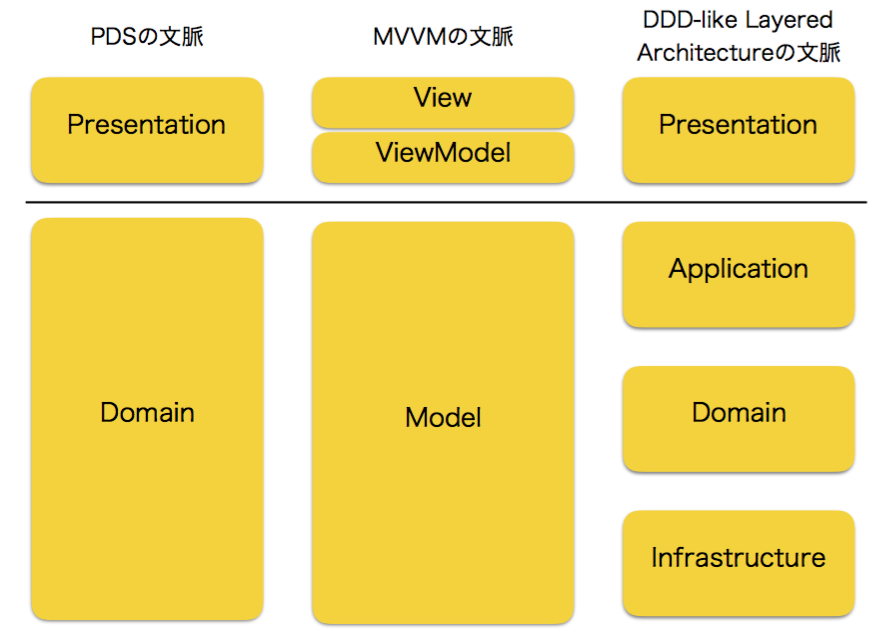
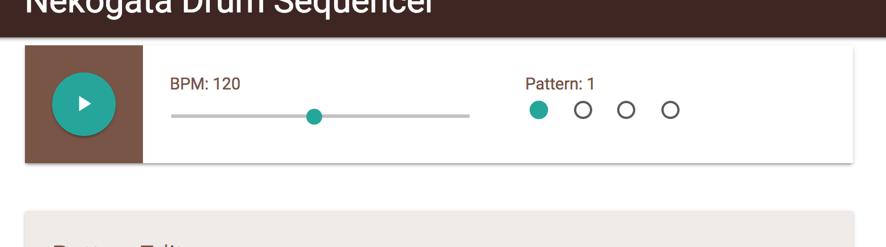

# NekogataDrumSequencer

## これはなに？

しんぺい a.k.a. 猫型蓄音機が、MVVMとCleanArchitectureの解説のために作ったデモアプリケーションです。「状態をたくさんもつ」ものとして、ドラムシーケンサーを実装しました。デモを[GithubPages](https://shinpeim.github.io/NekogataDrumSequencer/build/)で公開しています。

## MVVM と DDD-like Layered Architecture

MVVMパターンは、GUIのアーキテクチャパターンの一種で、PresentationとDomainの分離（PDS）を目的としたパターンです。MVVMパターンを採用することによって、プラットフォーム依存なUIの定義とイベントへの反応をViewとViewModelに書き、その他すべてをModelに書くことによって、「複雑だしプラットフォーム依存でテストしにくいUIのコード」と「アプリケーションの挙動をモデリングしたコード」を分離することができます。

その一方で、MVVMは「モデルはこう設計しましょう」ということについては指針をくれません。これは、言い方を変えれば、MVVMを採用したからといってアプリケーション全体の設計が決まるわけではなく、MVVMは「プレゼンテーションとその他をどうやって分けるか」について指針をくれるだけ、ということです。

一方、Layered Architectureは、その名のとおり、「アプリケーション全体を層に分けて設計しましょうね」という指針です。DDDの文脈では、よく「プレゼンテーション」「アプリケーション」「ドメイン」「インフラストラクチャ」の層に分けることによって「ドメイン知識」をドメイン層に分離する、という方針が取られることが多いようです。これをここでは「DDD-like Layered Architecture」と呼びましょう。

このあたりの話について、さらに知りたいひとは手前味噌ですが是非わたしの以下の発表を参考にしてください。

- see [「あの日見たM V WhateverのModelを僕たちはまだ知らない」実況中継](http://techblog.reraku.co.jp/entry/2016/12/13/080000)
- see [実況中継シリーズ Vue.jsで実現するMVVMパターン Fluxアーキテクチャとの距離](http://techblog.reraku.co.jp/entry/2016/07/06/070529)

さて、PDS、MVVM、DDD-like Layered Architectureというみっつの概念が出てきました。すべて、「アプリケーションをどのように分割するか」についての指針ですが、文脈が異なります。

PDSは「プレゼンテーションとその他を分けましょう」という指針です。

MVVMは、「実際にプレゼンテーションとその他を分けるときにはこういうふうにやるといいよ」という指針をくれます。

DDD-like Layered Architectureは、この「その他」の部分をさらに細かく「Application」「Domain」「Infrastructure」に分け、「アプリケーション全体はこうやって分けるといいよ」という指針をくれます。

これらの関係を図に表すと、下図のようになります。

図１：PDSとMVVMとDDD-like Layered Architectureの関係


このドキュメントでは、実際このリポジトリで開発されているアプリケーションの実装例を通じて、「それぞれのレイヤーがそれぞれをどのように呼び出したり依存したりするルールにするときれいにこれらの層が分離できるのか」について見ていきます。

## MVVMの文脈から見る、ViewModelの責務

MVVMにおいて、（PDSの文脈における）PresentationとDomainとのやりとりを実現してくれるのはViewModelです。ViewModelは、みっつの責務を持つことでPresentationとDomainを仲介します。

- Viewの描画のために必要なデータの保持
- Viewからのイベントに応じて、Modelのvoidなメソッドを呼び出す
- モデルの変化イベントに応じて、モデルの値を読み出して自身のデータを更新する

では、ここで実際に、ViewとViewModelの実装を見に行ってみましょう。今回のアプリケーションならば、`/presentation/vue_components`にかかれているものがViewとViewModelになります。ここでは[コントロールパネルのコンポーネント](https://github.com/Shinpeim/NekogataDrumSequencer/blob/development/src/js/presentation/vue_components/ControlPanel.vue)を見てみましょう。このコンポーネントでは、デモアプリの「再生ボタンとかbpmスライダーがある部分」のViewとViewModelが定義されています。

図２：再生ボタンとかbpmスライダーがある部分


### Viewの描画のために必要なデータの保持という責務

まずは、Viewの描画のために必要なデータの保持という責務について見ていきましょう。scriptの中身に、`data`というメソッドと`computed`というプロパティがあります（Vue.jsが定義してくれてるやつですね）が、Vue.jsにおいてはこれらがまさに「Viewのためのデータの保持」の役割です。

```
        data(){
            return {
                bpm: this.usecase.player.bpm,
                selectedPatternId: this.usecase.sequencer.selectedPatternId,
                playingState: this.usecase.player.playingState,
                isSoundsInited: this.usecase.player.isSoundsInited
            }
        },

        computed:{
            playButtonIcon(){
                if (this.playingState) {
                    return 'stop';
                } else {
                    return 'play_arrow';
                }
            }
        }
```

まずは`data`を見てみましょう。たとえば、bpmスライダーの位置や、「現在のBPM」を描画するためには、現在設定されているbpmがいくつなのかという情報が必要になりますし、ラジオボタンのどれが選択されているかを描画するためには、今どのパターンが選択されているかという情報が必要になります。同じように、ボタンに再生マークを出すか停止マークを出すかを決めるためには、現在再生中なのか再生中でないのかという情報が必要になります。これらの情報を、`data`で返すオブジェクトのプロパティとして定義しています。

また、このアプリケーションはmaterializeというcssフレームワークを利用していますが、materializeでは再生マークを出すためには`play_arrow`という文字列が、停止マークを出すためには`stop`という文字列が必要になります。どちらの文字列をViewに渡すべきかというのは、`playingState`が決定すれば自動的に決定しますね、こういったデータについては、`computed`というプロパティに定義してあげるといいでしょう。

ここで定義されたプロパティは、`template`のなかでVue.jsが用意してくれたディレクティブなどから読み出すことができます。Vue.jsの詳しい使いかたについて説明し始めると長くなってしまうので（とはいえ学習コストの低いフレームワークではあります）、詳しくは[Vue.jsの公式のドキュメント](https://vuejs.org/)を当たってください。

### Viewからのイベントに応じて、Modelのvoidなメソッドを呼び出す責務

次に、Viewからのイベントに応じて、Modelのvoidなメソッドを呼び出す責務について見ていきます。`methods`というプロパティがその責務を実現しています。

```
        methods: {
            setBpm(){
                const bpm = document.getElementById("bpm-slider").value;
                this.usecase.setBpm(bpm);
            },

            setPatternId() {
                this.usecase.selectPattern(this.selectedPatternId);
            },

            togglePlayingState(){
                this.usecase.togglePlayingState();
            }
        }
```

bpmスライダーのViewは

```
<input type="range" id="bpm-slider" min="10" max="240" :value="bpm" @input="setBpm"/>
```

と定義されていますが、ユーザがスライダーを変化させると、HTML上に定義されている`@input="setBpm"`イベントが発火し、`methods`プロパティ内に定義されている`setBpm`メソッドが呼び出されます。ここが、「Viewからのイベントに応じ」の部分です。`setBpm`メソッドの中身を見てみると、DOMから「現在選択されているbpm」を読み出し、`this.usecase`のメソッドを呼び出しています。`this.usecase`について、詳しくは後述しますが、ViewModelが保持している、「Model層の窓口」だと思ってください。ここが「Modelのvoidなメソッドを呼び出す」の部分です。

### モデルの変化イベントに応じて、モデルの値を読み出して自身のデータを更新する責務について

最後に、モデルの変化イベントに応じて、モデルの値を読み出して自身のデータを更新するという責務について見ていきましょう。

さきほど、「Viewからのイベントに応じて、Modelのvoidなメソッドを呼び出す」責務について見ました。しかし、当たりまえですが、voidなメソッドには返り値がありません。これでは、「ViewModel -> Model」のコミュニケーションはできますが、「Model -> ViewModel」のコミュニケーションができませんね。

MVVMアーキテクチャでは、ModelからViewModelへのコミュニケーションは「Modelが変化したよ」というイベントを通知する形で行います。ViewModelは、そのイベントを受け取ったら、Modelの内容を読み取って、自身のデータに書き戻します。それを行っているのが`created`プロパティです。

```
       created(){
            this.subscriptions.push(
                // (1)
                this.usecase.selectedPatternChanged.subscribe(() => {
                    this.selectedPatternId = this.usecase.sequencer.selectedPatternId;
                })
            );

            this.subscriptions.push(
                this.usecase.playingStateChanged.subscribe(() => {
                    this.playingState = this.usecase.player.playingState;
                })
            );

            this.subscriptions.push(
                this.usecase.bpmChanged.subscribe(() => {
                    this.bpm= this.usecase.player.bpm;
                })
            );

            this.subscriptions.push(
                this.usecase.isSoundsInitedChanged.subscribe(() => {
                    console.debug(this.usecase.player);
                    this.isSoundsInited = this.usecase.player.isSoundsInited;
                })
            );
        },
```

まずは

```
this.usecase.selectedPatternChanged.subscribe(() => {
    this.selectedPatternId = this.usecase.sequencer.selectedPatternId;
})
```

の部分を見てください。「Modelの窓口」に当たる`usecase`が、`selectedPatternChanged`というプロパティを持っています。Modelが保持している「今どのパターンが選択されているか」という情報が変化したときに、このプロパティはイベントを発火させます（というか、Model層にそういう処理が書かれています）。

で、このプロパティに対して、`subscribe`することで、リスナーを登録しています。リスナーの中身は、`this.selectedPatternId = this.usecase.sequencer.selectedPatternId;`となっており、「モデルの値を読み出してきて、自身のデータ（`data`プロパティで定義したやつです）に書き戻していますね。ViewModelのデータがこうして更新されると、Vue.jsの「データバインド」の仕組みで、画面が書き換わる、というわけです。

`this.subscriptions`とかは、`Base.js`で定義されてるやつで、ここに登録しておいたリスナーはコンポーネントが破棄されるときに勝手に`unscribe`してくれるようになっています。

`created`はコンポーネントが作られたときに呼ばれるhookですが、コンポーネントが作られたときに「Modelが変化したっていうイベントを受け取ったらその内容を自分に書き戻す」というリスナーを登録しているわけですね。

### ViewModelの責務まとめ

さて、これで、

- Viewの描画のために必要なデータの保持
- Viewからのイベントに応じて、Modelのvoidなメソッドを呼び出す
- モデルの変化イベントに応じて、モデルの値を読み出して自身のデータを更新する

というViewModelのみっつの責務を確認できました。

重要ななのは、Modelのメソッド呼び出しがvoidであることと、Modelからの変更通知はイベントを通じて行う、という部分です。

これによって、モデルのメソッド呼び出しという「更新系」の窓口、モデルの状態読み出しという「参照系」の窓口が分離されます。この分離を行うことで、PDSの文脈における「Presentation」と「Domain」を疎結合に保つことに成功しているのが、MVVMアーキテクチャである、と考えてください。

## DDD-like Layered Architectureで複雑なモデルと非同期処理に立ち向かう

執筆中

## DDD-like Layered Architectureに依存性逆転の法則を導入することで、テスタビリティの高いCleanArchitectureが実現される

執筆中


## License

MIT

## Copyright

Copyright 2017 Shinpei Maruyama